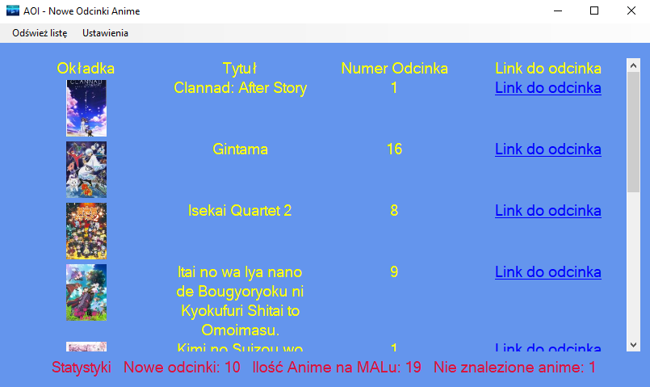
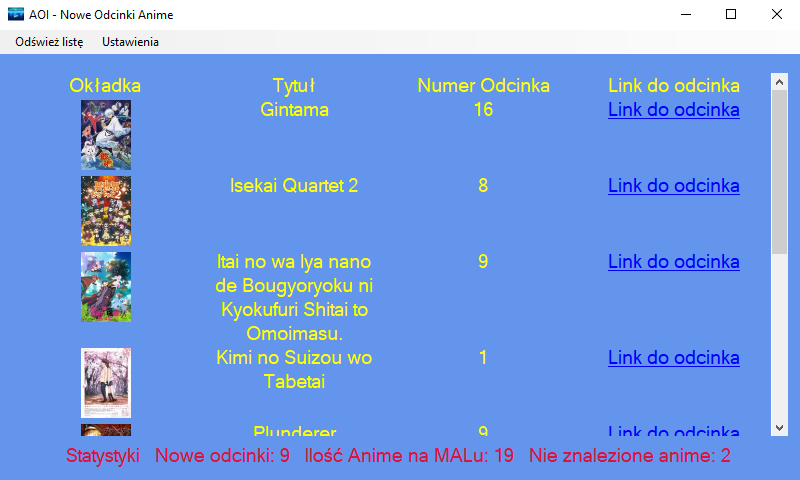
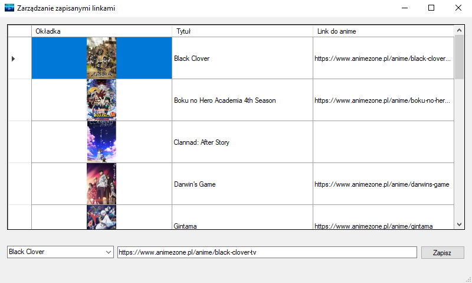
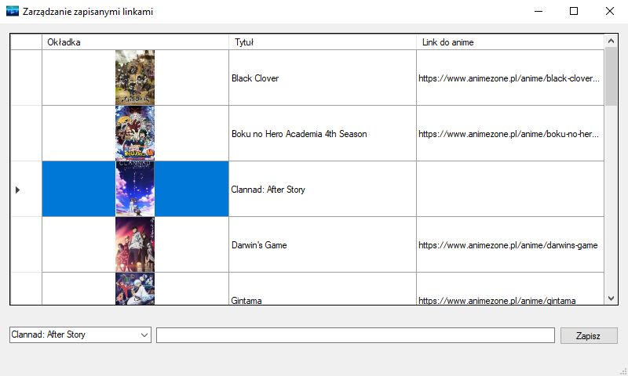
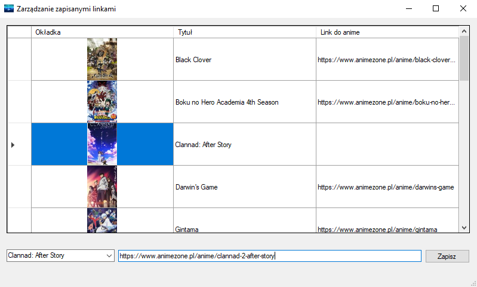
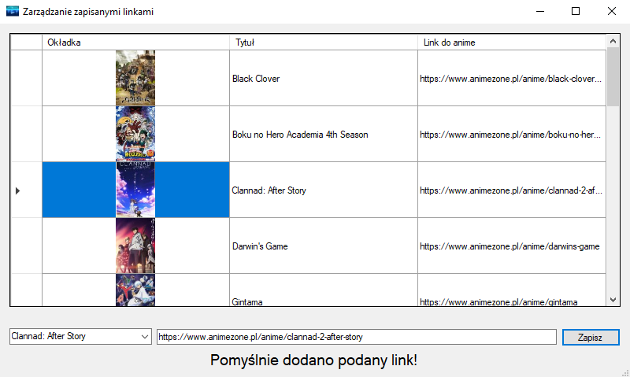

# AOI
Aplikacja wyświetlająca listę dostępnych odcinków anime z polskimi napisami dla wprowadzonego wcześniej użytkownika serwisu MAL. (WinForms App)

## Zewnętrzne dodatki do Visuala
* [Microsoft Visual Studio Installer Projects](https://marketplace.visualstudio.com/items?itemName=VisualStudioClient.MicrosoftVisualStudio2017InstallerProjects "Microsoft Visual Studio Installer Projects")

## Działanie Programu
* pobiera dane z serwisu `https://myanimelist.net/` o wszystkich anime znajdujących się w sekcji "watching" wprowadzonego wcześniej użytkownika oraz o jego aktualnym postępie w ich oglądaniu
* wyszukuje w serwisie `https://www.animezone.pl/` linku do anime, w przypadku gdy nie mamy go zapisanego w pamięci
* porównuje numer najnowszego odcinka przetłumaczonego na język polski z tym, który znajduje się na naszej liście w serwisie MAL
* wyświetla listę dostępnych odcinków anime do obejrzenia wraz z linkami do nich
* zapisuje w pamięci nick wprowadzonego wcześniej użytkownika oraz linki do wszystkich znalezionych serii anime w celu wykorzystania ich przy kolejnym odpaleniu programu

## Funkcje
* **Odśwież listę** Wykonuje ponownie wszystkie operacje wymienione w sekcji [Działanie Programu](#Działanie-Programu)
* **Zmień konto MAL** Podmieni aktualnie zapisany nick konta w serwisie MAL, z którego listy są pobierane dane
* **Zarządzaj linkami anime** Umożliwia podgląd przypisanych linków do poszczególnych serii oraz pozwala na ich podmianę

## FAQ
* **W staystykach posiadam "Nie znalezione anime". Co robić?**  
>W przypadku, gdy program nie był wstanie samodzielnie odnaleźć anime w serwisie `https://www.animezone.pl/` informuje o tym użytkownika w statystykach. W związku z tym posiadamy 2 opcje:  
  -> nic z tym nie robić  - program przy każdym uruchomieniu, będzie poszukiwał anime w serwisie, aż do odnalezienia i zapisania go w pamięci 
  -> ręcznie odnaleźć link w podanym serwisie i przypisać go do anime. (**Ustawienia**=>**Zarządzaj linkami anime**)   
Przykład:

 
 

